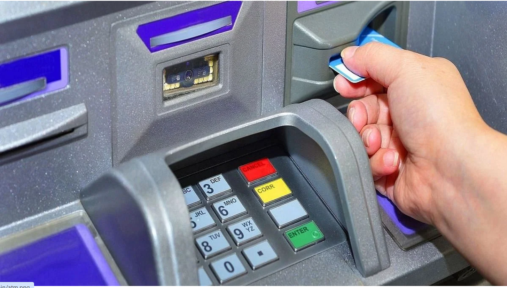
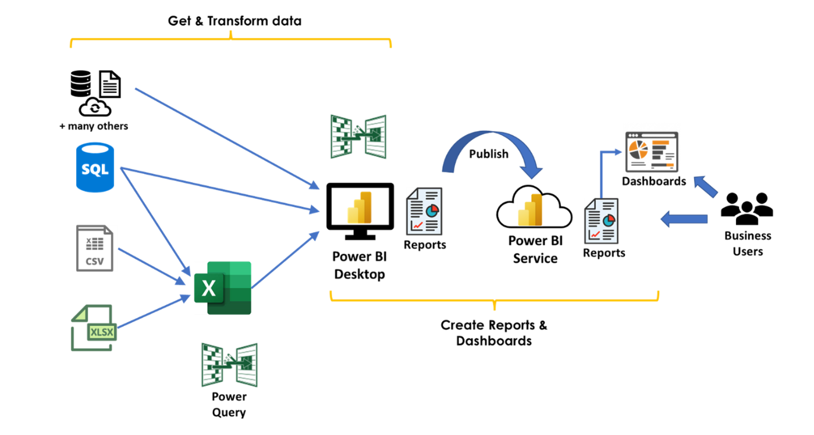
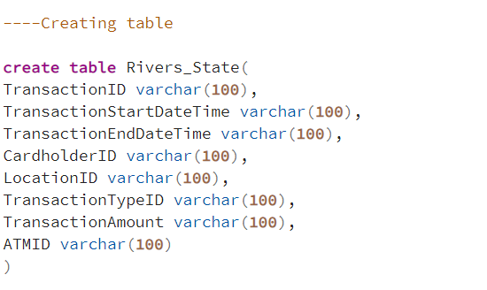
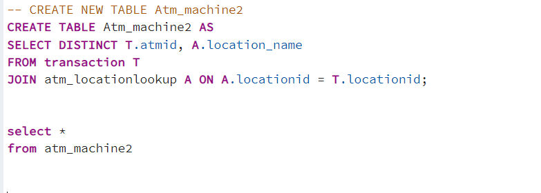
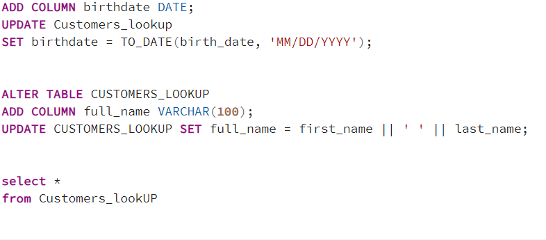
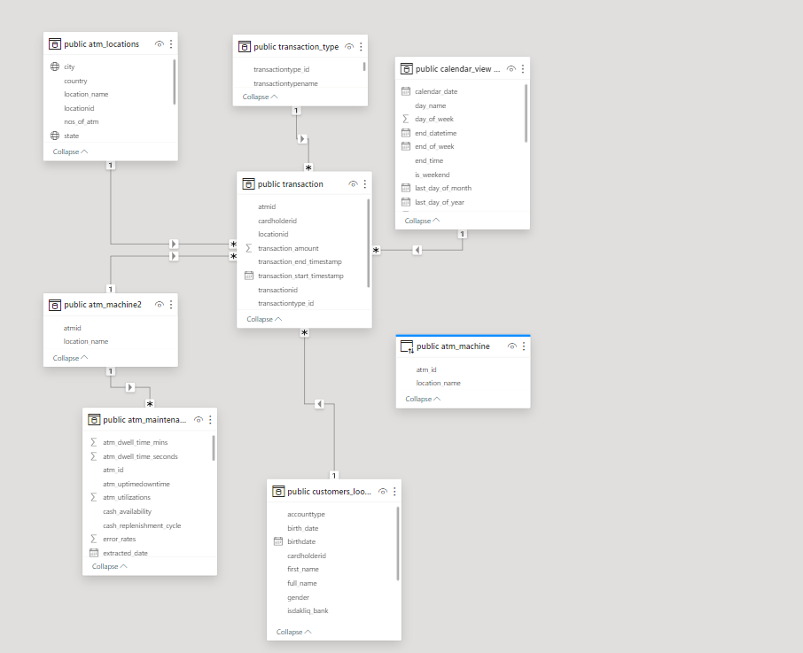
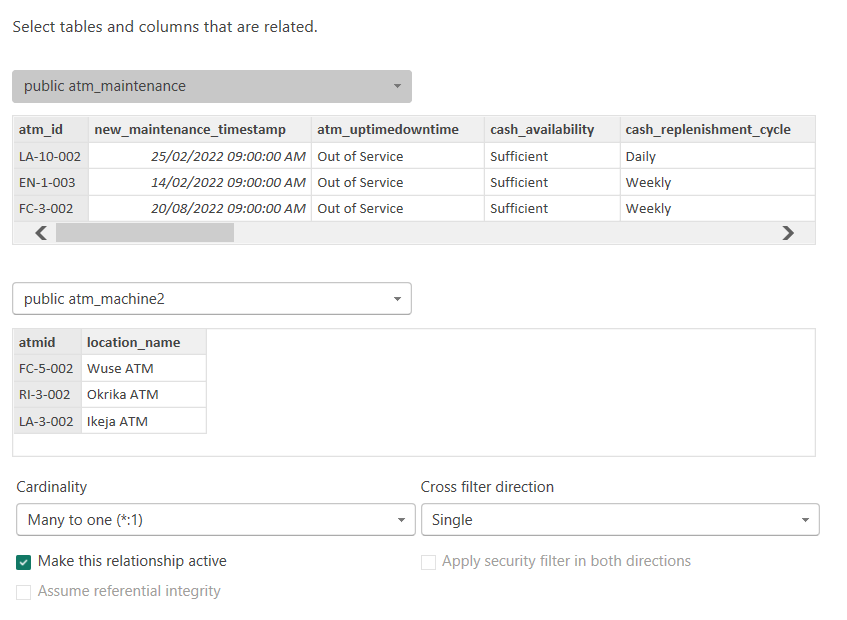
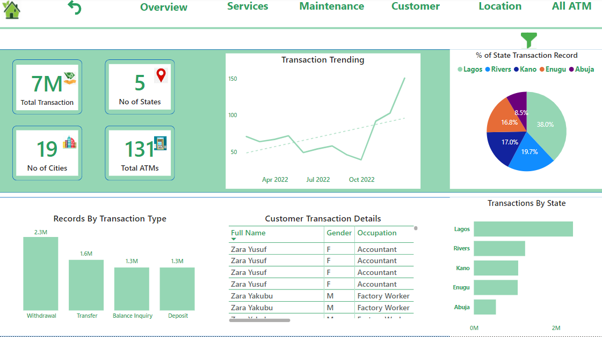
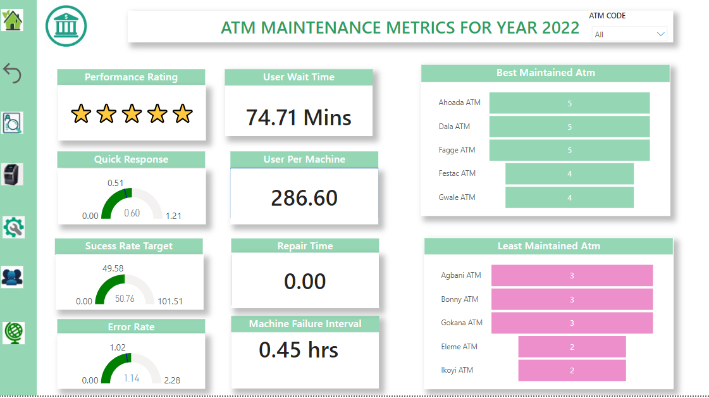

# Optimizing_Atm_Performance_Strategies

## INTRODUCTION

In today's rapidly evolving banking landscape, customer retention has emerged as a critical success factor for financial institutions. The ability to retain loyal customers directly impacts profitability, market share, and brand reputation. One significant touchpoint with customers is the Automated Teller Machine (ATM), which remains a fundamental channel for cash withdrawal and various banking transactions. In light of the importance of customer retention, we embark on a transformative Business Intelligence and Data Analytics project aimed at exploring data-driven strategies for optimizing ATM performance and, in turn, enhancing customer retention. By harnessing the power of data analytics, we seek to unlock valuable insights that will enable us to better understand customer behavior, improve operational efficiency, and ultimately cultivate lasting customer relationships.

## OBJECTIVES

With the power of data analytics and a customer-centric approach, this project aspires to empower financial institutions with the tools to make informed decisions that drive customer retention and loyalty. By optimizing ATM performance, banks can not only improve operational efficiency but also deliver an exceptional customer experience that nurtures lasting relationships and positions them for sustained success in today's competitive financial landscape.

- Identify Factors Affecting Customer Retention By analyzing transaction data and customer feedback, I aim to pinpoint factors that impact customer retention, such as transaction success rates, wait times, and 
  customer experience.
- Analyze ATM Usage Patterns I will delve into the patterns of ATM usage, identifying peak hours, days, and seasonal trends. Understanding when and how customers engage with ATMs is pivotal to optimizing service 
  availability and ensuring customer satisfaction.
- Evaluate ATM Performance Assessing the performance of individual ATMs and comparing performance across different locations will help us identify areas of improvement and prioritize resource allocation.
  Optimize ATM Servicing and Maintenance By evaluating maintenance schedules and correlating them with ATM performance, we can optimize servicing to prevent downtime and disruptions.

## Tools used
- Microsoft CSV
- PostgreSQL Database
- Microsoft Power BI Desktop

## Dataset Description:
The dataset comprises a collection of dimension tables, including Customer, ATM Maintenance, Calendar, ATM Location, Hour, and Transaction Type. Additionally, there is one fact table named "Transaction Table," which contains a multitude of transactions spanning five different states in Nigeria. These states are Lagos, Enugu, FCT (Federal Capital Territory), Rivers, and Kano.

## Data Dictionary:
To ensure clarity and understanding, I have access to a meticulously defined data dictionary. This resource provides comprehensive explanations for the table and column structures, aiding our data analysis process.

## Data transformation
Most of my data transformation processes were executed on PostgreSQL Database. In these processes, I performed tasks such as appending data, generating new calendar tables, creating a bridge table to link the transaction table with the maintenance table, and employing the alter and update functions to modify specific tables, as depicted in the screenshot below.

## Example1 
  
## Example2 
 
## Example3 

## Data Modelling
I implemented the snowflake model, connecting all my facts and dimensions seamlessly. I utilized the import storage mode to bring in my data into Power BI, where I established relationships. The majority of these relationships have a one-to-many cardinality, and a single filter direction was applied, as illustrated in the screenshot below.

## Snowflakeschema

## Relationship

## Analysis and visualization

1. A comprehensive examination spanning four years uncovered a total of 6.52 million ATM transactions from 2019 to 2022, with a notable peak in March 2022.
2. Withdrawals emerged as the predominant transaction type, constituting 34.99% of the total, followed by transfers (24.1%), balance inquiries (20.46%), and deposits (20.45%).
3. Remarkably, the student population emerged as frontrunners in transactions, contributing 818,669 transactions with an impressively brief average waiting time of 5.69 minutes.
4. Geographically, the city of Lagos took the lead, accounting for 43.21% of all transactions, trailed by Rivers (20.88%), Kano (18.96%), Enugu (17.86%), and Abuja (8.25%).
5. Interestingly, the efficiency of ATMs varied, with some boasting an average customer waiting time as low as 4.77 minutes, while others subjected customers to a more extended wait of 11.09 minutes.
6. In the year 2022, a meticulous maintenance analysis highlighted the best-maintained ATMs, such as Ahoda, Dala, Tarauni, Warawa, and Fagge, earning 5–6-star ratings. On the flip side, the least maintained ATMs,    including Bonny, Gwale, Gokana, Ikeja, and Sabo Bank, garnered ratings ranging from 0 to 3 stars.
7. This in-depth analysis underscores the imperative of enhancing the maintenance of less-maintained ATMs, particularly those situated in close proximity to student environments. The findings advocate for the        adoption of data-driven optimization strategies to elevate customer experiences within the realm of ATMs.

##  Overview Report

## Maintenance Report

## Conclusion
As I wrap up my journey, the lesson is clear. ATMs are not just machines; they are financial gateways. The least maintained machines must be nurtured, and the ATMs close to student environments require special care. It's time for banks and financial institutions to embrace data-driven optimization, enhancing the customer experience and making the ATM an efficient and reliable friend to all. **_Click here to view full reports [Here](https://app.powerbi.com/view?r=eyJrIjoiYzViNDdkMjUtNTBmMS00YjM4LWI5MzktOGM1YjMyNTRjYTk1IiwidCI6ImZiNjI0Y2ZkLWQzYjEtNGIwYi05NmQxLThkMzg3ZWQxYmMyZSIsImMiOjh9)_**

## Recommendations

- The Road Ahead The journey to ATM excellence continues, with newfound insights and a roadmap to unlock its hidden potential. The future lies in the integration of cutting-edge technologies like biometrics,        artificial intelligence, and contactless payments. By embracing digital transformation, the ATM experience will become faster, more secure, and seamlessly connected to the wider world of financial services.

- Empowering Customers Empowering the customers should be at the heart of every ATM strategy. Implementing personalized experiences, offering tailored financial advice, and providing seamless integration between    the digital and physical banking worlds will turn ATMs into trusted companions in customers' financial journeys. By making the ATM experience delightful and efficient, financial institutions will build            stronger relationships with their customers and drive loyalty.

- Maximizing Security In an era of increasing cyber threats, security is paramount. Banks must invest in robust security measures to protect both the customers' transactions and their personal information.          Enhanced encryption, biometric authentication, and continuous monitoring are essential components of a secure ATM network. By prioritizing security, banks can ensure the trust and confidence of their customers    in the ATM ecosystem.

  

 ## **_Thanks for reading 🙇‍♀️_**
